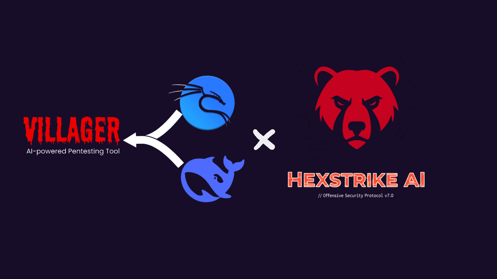

<div align="center">
  
</div>

**AI-Driven Cybersecurity Automation Platform**

*BUG* currently the docker containers are not installing tools for each ssh persistent dockers. working on this 

Villager is a powerful AI framework that orchestrates cybersecurity operations through intelligent task decomposition, agent scheduling, and seamless integration with security tools. It implements the true Villager architecture with TaskNode execution, MCP Client integration, and containerized Kali Linux environments.

Before implementing this current hybrid setup follow the instructions on https://github.com/0x4m4/hexstrike-ai and make sure its configured with your chosen enviroment. Currently i have only tested this using cursor AI and using a local uncensored deepseek model to orchestrate the villager workflow. I hope this enhances everyones automation capabilties and we can solve the long task completion issue people face when running very long assesments. Villager should be able to handle and batch it intelligently avoiding exhaustion of the cursor model on its own. 

This is just an idea to inspire others to test similiar things and contribute 

## 🚀 Quick Start (Copy & Paste)

```bash
# Complete setup in one go - installs ALL dependencies automatically
git clone https://github.com/Yenn503/villager-ai-hexstrike-integration.git
cd villager-ai-hexstrike-integration
./setup.sh
```

**That's it!** The setup script will automatically install Docker, Kali tools, Ollama, Python dependencies, and start all services. Your Villager AI framework will be fully operational.

> **🎯 One-Command Setup**: The `setup.sh` script handles everything - no manual dependency installation needed!

##  What is Villager?

Villager is an **AI orchestration framework** that:
- **Decomposes complex security tasks** into manageable subtasks using AI reasoning
- **Schedules and coordinates agents** to execute security operations
- **Integrates with security tools** through containerized environments
- **Provides MCP integration** for seamless tool access and automation

##  Architecture Overview

```
┌─────────────────┐    ┌──────────────────┐    ┌─────────────────┐
│   Cursor MCP    │───▶│  Villager MCP    │───▶│ Villager Server │
│                 │    │  (villager_proper│    │   (port 37695)  │
│                 │    │   _mcp.py)       │    │                 │
└─────────────────┘    └──────────────────┘    └─────────┬───────┘
                                                         │
                                                         ▼
┌─────────────────┐    ┌──────────────────┐    ┌─────────────────┐
│   Kali Driver   │◀───│   MCP Client     │◀───│   TaskNode      │
│   (port 1611)   │    │   (port 25989)   │    │                 │
└─────────────────┘    └──────────────────┘    └─────────────────┘
```

### **Service Architecture**
- **Villager MCP Server** - True Villager framework integration with TaskNode execution
- **Villager Server** (Port 37695) - Task management and orchestration
- **MCP Client** (Port 25989) - Service communication and streaming responses
- **Kali Driver** (Port 1611) - Security tools execution (msfvenom, nmap, etc.)
- **Browser Automation** (Port 8080) - Web automation capabilities

## 🔗 Integration with HexStrike

Villager works **alongside** HexStrike to provide a complete cybersecurity automation ecosystem:

### **Villager's Role: AI Orchestration**
- **Task Decomposition**: Breaks down complex security operations into manageable tasks
- **Agent Scheduling**: Coordinates multiple AI agents for different aspects of security testing
- **Tool Integration**: Manages and orchestrates security tools through MCP protocol
- **Decision Making**: Uses AI reasoning to determine the best approach for each task

### **HexStrike's Role: Tool Execution**
- **Security Tools**: Provides 150+ specialized cybersecurity tools
- **Payload Generation**: Creates custom payloads and exploits
- **Vulnerability Scanning**: Performs comprehensive security assessments
- **Report Generation**: Produces detailed security reports

### **How They Work Together**
1. **Villager** receives a high-level security task (e.g., "Perform penetration test on target")
2. **Villager** decomposes this into subtasks using AI reasoning
3. **Villager** schedules agents to execute specific operations
4. **HexStrike** provides the actual security tools and execution capabilities
5. **Villager** coordinates the results and generates comprehensive reports

##  Key Features

- **🤖 AI-Driven Operations**: Intelligent task decomposition and agent orchestration
- **🔧 True Architecture**: Implements proper Villager framework with TaskNode execution
- **🐳 Containerized Security**: Isolated Kali Linux environments for safe tool execution
- **🔗 MCP Integration**: Seamless Model Context Protocol integration for tool access
- **🛡️ Uncensored AI**: Local Ollama integration with unrestricted cybersecurity capabilities
- **📊 GitHub Integration**: Repository management and tool discovery capabilities
- **⚡ Real Security Tools**: Access to MSFVenom, Nmap, SQLMap, and thousands of Kali tools

## 📋 Quick Start

### Prerequisites
- **Python 3.8+**
- **Docker** (for persistent SSH containers)
- **Ollama** (for local AI model)

> **🎯 True Villager Architecture**: Persistent SSH containers with 24-hour self-destruct, tools pre-installed, forensic evasion through ephemeral lifecycle!

## 🚀 Quick Start (Complete Setup)

### **One-Command Installation (Recommended)**
```bash
# Clone and setup everything automatically
git clone https://github.com/Yenn503/villager-ai-hexstrike-integration.git
cd villager-ai-hexstrike-integration
./setup.sh
```

> **🎯 Automated Setup**: The `setup.sh` script installs Docker, Kali tools, Ollama, Python dependencies, and starts all services automatically.

### **Step-by-Step Installation**

1. **Clone the repository:**
```bash
git clone https://github.com/Yenn503/villager-ai-hexstrike-integration.git
cd villager-ai-hexstrike-integration
```

2. **Set up virtual environment:**
```bash
python -m venv villager-venv-new
source villager-venv-new/bin/activate  # On Windows: villager-venv-new\Scripts\activate
```

3. **Install all dependencies:**
```bash
pip install -r requirements.txt
```

4. **Install and configure Ollama:**
```bash
# Install Ollama
curl -fsSL https://ollama.ai/install.sh | sh

# Pull the uncensored AI model
ollama pull deepseek-r1-uncensored

# Start Ollama server
ollama serve &
```

5. **Configure environment:**
```bash
# Copy the example configuration
cp .env.example .env

# Edit .env with your preferred settings
# The file includes detailed instructions for each option
```

**Quick Configuration Options:**
- **Ollama (Recommended)**: Free, local, uncensored AI - no API keys needed
- **DeepSeek API**: Cloud-based AI with API key
- **OpenAI API**: Cloud-based AI with API key
- **GitHub Integration**: Optional repository management features

6. **Verify installation:**
```bash
./tests/run_tests.sh
```

7. **Start Villager:**
```bash
./start_villager_proper.sh
```

### **✅ Verification**
After installation, you should see:
- ✅ All services running on their respective ports
- ✅ Villager Server: http://localhost:37695
- ✅ MCP Client: http://localhost:25989
- ✅ Kali Driver: http://localhost:1611
- ✅ Browser Service: http://localhost:8080

### **🔧 Troubleshooting**
If you encounter issues:

1. **Check if all services are running:**
```bash
lsof -i -P -n | grep LISTEN | grep -E "(25989|1611|37695|8080)"
```

2. **Check service logs:**
```bash
tail -f logs/villager_server.log
tail -f logs/mcp_client.log
tail -f logs/kali_driver.log
```

3. **Re-run tests:**
```bash
./tests/run_tests.sh
```

4. **Restart all services:**
```bash
pkill -f "python.*services"
./start_villager_proper.sh
```

## 🔧 MCP Integration

Configure Villager in your MCP client (e.g., Cursor IDE):

```json
{
  "mcpServers": {
    "villager-proper": {
      "command": "/path/to/your/Villager-AI/villager-venv-new/bin/python3",
      "args": [
        "/path/to/your/Villager-AI/mcp/villager_proper_mcp.py",
        "--debug"
      ],
      "description": "Villager AI Framework - AI-Driven Cybersecurity Automation",
      "timeout": 300,
      "alwaysAllow": [],
      "env": {
        "PYTHONUNBUFFERED": "1",
        "PYTHONPATH": "/path/to/your/Villager-AI",
        "LLM_PROVIDER": "ollama",
        "OLLAMA_BASE_URL": "http://localhost:11434",
        "OLLAMA_MODEL": "deepseek-r1-uncensored"
      }
    }
  }
}
```

##  Available MCP Tools

### Task Management
- `mcp_villager-proper_create_task(abstract, description, verification)` - Create AI-driven tasks
- `mcp_villager-proper_get_task_status(task_id)` - Monitor task progress
- `mcp_villager-proper_list_tasks()` - List all active tasks

### Agent Orchestration
- `mcp_villager-proper_schedule_agent(agent_name, task_input)` - Schedule AI agents

### Tool Execution
- `mcp_villager-proper_execute_tool(tool_name, parameters)` - Execute tools:
  - `pyeval` - Python code execution
  - `os_execute_cmd` - System command execution
  - `tool_villager` - Agent-specific functions
  - `github_tools` - GitHub API integration

### System Integration
- `mcp_villager-proper_get_system_status()` - Get comprehensive system status
- `mcp_villager-proper_list_available_tools()` - List all available tools

##  Usage Examples

### Creating a Security Assessment Task
```python
# Villager decomposes this into subtasks automatically
result = mcp_villager-proper_create_task(
    abstract="Perform comprehensive security assessment",
    description="Scan target network 192.168.1.0/24 for vulnerabilities, enumerate services, and identify potential attack vectors",
    verification="Provide detailed report with findings and recommendations"
)
```

### Scheduling a Security Analyst Agent
```python
result = mcp_villager-proper_schedule_agent(
    agent_name="Security Analyst",
    task_input="Analyze the network scan results and prioritize vulnerabilities by risk level"
)
```

### Executing Security Tools
```python
# Direct tool execution through Villager
result = mcp_villager-proper_execute_tool(
    tool_name="os_execute_cmd",
    parameters={"system_command": "nmap -sV -sC 192.168.1.1"}
)
```

##  Security Features

- **🛡️ Containerized Execution**: All security tools run in isolated Kali Linux containers
- **🧠 AI Task Decomposition**: Automatically breaks down complex operations into manageable steps
- **🔐 Secure Communication**: MCP protocol ensures secure tool access and data exchange
- **📊 Real Tool Access**: Direct integration with thousands of Kali Linux security tools
- **🎯 Targeted Operations**: AI agents can be specialized for specific security domains

## ⚙️ Configuration

### Environment Variables
```bash
# LLM Configuration (choose one)
export LLM_PROVIDER="ollama"                    # Local AI (recommended)
export OLLAMA_BASE_URL="http://localhost:11434"
export OLLAMA_MODEL="deepseek-r1-uncensored"

# Alternative: API-based LLM
export LLM_PROVIDER="deepseek"
export DEEPSEEK_API_KEY="your-api-key-here"

# Optional: GitHub Integration
export GITHUB_TOKEN="your-github-token-here"

# Server Configuration
export VILLAGER_HOST="0.0.0.0"
export VILLAGER_PORT="37695"
```

### MCP Client Endpoints
- **Kali Driver**: `http://localhost:1611` (Container Manager)
- **Browser Automation**: `http://localhost:8080` (Web interactions)
- **MCP Client**: `http://localhost:25989` (Tool access)

## 🧪 Testing

### Comprehensive Test Suite

Run the complete test suite to verify all components are working:

```bash
# Run all tests (recommended)
./tests/run_tests.sh

# Or run directly
python3 tests/test_villager_framework.py
```

The test suite verifies:
- ✅ Environment setup and dependencies
- ✅ Villager core imports and functionality
- ✅ MCP server initialization and status
- ✅ LLM provider connection (Ollama/DeepSeek/OpenAI)
- ✅ Tool execution (Python, OS commands)
- ✅ Security tools availability (MSFVenom, Nmap, etc.)
- ✅ GitHub integration (optional)
- ✅ Docker availability

### Quick Test

Test basic MCP connection:

```bash
# Test MCP connection
python -c "
import sys
sys.path.append('/path/to/your/Villager-AI')
from mcp.villager_proper_mcp import VillagerProperMCP
villager = VillagerProperMCP()
print(villager.get_system_status())
"
```

## 📦 Dependencies

### Core Requirements
- **`requirements.txt`** - All dependencies needed to run Villager AI Framework

### Key Dependencies
- **Villager Framework** - Core AI orchestration framework
- **MCP (Model Context Protocol)** - AI assistant integration
- **FastAPI & Uvicorn** - Web server and API framework
- **OpenAI & LangChain** - AI model integration
- **Pydantic** - Data validation and settings management
- **Requests & HTTPX** - HTTP client libraries

### Installation
```bash
# Install all dependencies
pip install -r requirements.txt
```

## 📚 Documentation

All documentation is organized in the [`docs/`](docs/) directory:

- **[📖 Documentation Index](docs/README.md)** - Complete documentation overview
- **[🤖 AI Assistant Guide](docs/AI_ASSISTANT_GUIDE.md)** - Complete guide for AI assistants
- **[🚀 Setup Instructions](docs/PROPER_VILLAGER_SETUP.md)** - Detailed setup guide
- **[🔧 Implementation Summary](docs/IMPLEMENTATION_SUMMARY.md)** - Technical details
- **[🐛 Debug Guide](docs/VILLAGER_DEBUG_AND_ORCHESTRATION_GUIDE.md)** - Troubleshooting
- **[✅ Final Setup Instructions](docs/FINAL_SETUP_INSTRUCTIONS.md)** - Final setup steps

## 🤝 Contributing

1. Fork the repository
2. Create a feature branch
3. Make your changes
4. Test thoroughly
5. Submit a pull request

## ⚠️ Disclaimer

**This framework is for educational and authorized testing purposes only.**

- Users must have proper authorization before testing any network or system
- The framework provides access to real security tools and should only be used in controlled environments
- Users are responsible for ensuring compliance with applicable laws and regulations
- This tool should not be used for malicious purposes or unauthorized access

## 📄 License

This project is licensed under the MIT License - see the LICENSE file for details.

---

**Villager AI Framework** - *Intelligent Cybersecurity Automation*
