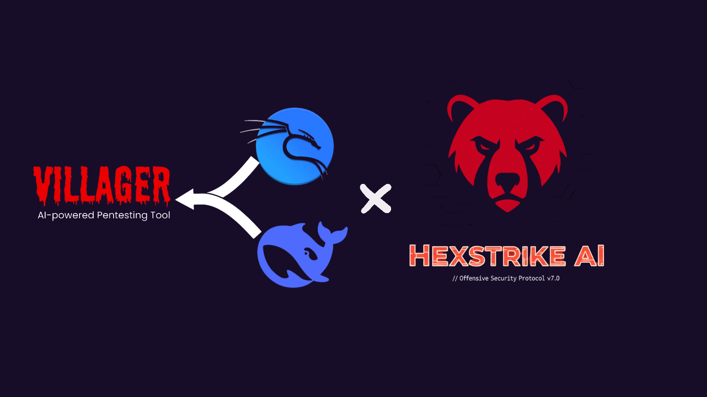

# 🛡️ Villager AI + HexStrike Integration



It's a hybrid framework that connects two powerful systems: Villager AI, a team of autonomous AI agents for complex strategy, and HexStrike, a massive arsenal of over 150 security tools.

Think of it like this: HexStrike is the giant toolbox with everything from scanners to exploit frameworks. Villager AI is the team of expert engineers who know exactly which tool to use, how to use it, and can even build new tools when needed. They work together to handle anything you throw at them.

I have included a GitHub Tool Discovery Agent that can find, install, and integrate new tools from GitHub on its own, making the entire system self-evolving with tuning. Currently it can use the github envirmonent as a whole. 

I first ask all to go to https://github.com/0x4m4/hexstrike-ai and follow the install steps for your chosen enviroment. Once done come back here to intergrate the hybrid setup. Personally i love to do alot of maldev research and messing with c2 infastructures so villager comes in handy for this with python code execution and full kali/Github access for all tools even your own for further exploitation i dont see a limit everything can be linked in some way so this can sure be used to enhance Hexstrike and your own workflows. i will be adding more features into the mix and really dynamically testing this. currently this is the working soloution for all operations ready to be customed. Please use this safely by no means do i want to enable malicous activity. This is for all researchers to work on and understand, i hope this truly helps alot of people and inspires others to try out similiar things, we call all contribute to the landscape in some way. 

## 🏗️ How It Works: The Core Idea

The system is built on two main components that you can access through a single chat interface such as cursor, vscode even local setups. 

### 🧰 HexStrike: The Tool Arsenal

HexStrike is your direct-access toolkit. It's packed with 150+ essential security tools ready to go.

- **Network Scanning**: Nmap, Masscan, Rustscan
- **Web App Testing**: Nuclei, SQLMap, Burp Suite  
- **Exploitation**: Metasploit, Hydra, Hashcat
- **Forensics**: Volatility, Ghidra, Radare2
- **Cloud & Containers**: Prowler, Trivy, Kube-hunter

Use HexStrike when you know exactly what you want to do. It's for fast, specific commands where you want total control.

```bash
# Example: You need a quick port scan.
mcp_hexstrike-ai_nmap_scan(target="192.168.1.1", ports="80,443")
```

### 🧠 Villager AI: The Autonomous Agents

Villager AI is where the magic happens. It's a team of 10 specialized AI agents that can plan, strategize, and execute complex, multi-step operations.

- **DeepSeek AI Brain**: Each agent thinks and reasons through problems
- **Task Decomposition**: They break down big goals (like "pwn this box") into smaller, manageable steps
- **Adaptive Strategy**: If one tool fails, they'll try another. They learn as they go
- **Tool Intelligence**: They automatically pick the best tool for the job from the HexStrike arsenal or even from their own capabilities

Use Villager AI when you have a goal, not a command. It's perfect for complex operations that require stealth, adaptation, and long-term persistence.

```python
# Example: You want to perform a full pentest.
create_agent(
    name="Pentest_Agent",
    task="Perform a comprehensive penetration test on target.com. Start with recon, find vulnerabilities, attempt exploitation, and generate a report."
)
```

### 🎯 When to Use Which System

**Use HexStrike Direct Commands When:**
- You need **immediate, specific tool execution**
- You want **direct control** over tool parameters
- You're doing **quick reconnaissance** or **single-point testing**
- You need **real-time results** without agent overhead

**Use Villager Agents When:**
- You need **complex, multi-stage operations**
- You want **autonomous decision-making** and adaptation
- You're doing **long-term operations** or **persistent access**
- You want **evasion and stealth** capabilities

**How the AI Assistant (Cursor) Decides:**
- **Simple tasks** → Direct HexStrike tools for speed
- **Complex operations** → Villager agents for intelligence
- **Tool overlap** → Villager agents choose optimal tools based on context (e.g., using HexStrike findings to inform Villager decisions)
- **Your explicit instructions** → Always followed (e.g., "use Villager for this" or "use HexStrike directly")
- **Context analysis** → AI determines if task needs autonomous reasoning or direct execution

## 🚀 Quick Start

Get up and running in a few minutes.

### 1. Setup

```bash
# Clone the repo
git clone https://github.com/Yenn503/villager-ai-hexstrike-integration.git
cd villager-ai-hexstrike-integration

# Copy the example .env file
cp .env.example .env

# Now, edit .env with your API keys
# DEEPSEEK_API_KEY=your-key-here
# GITHUB_TOKEN=your-personal-access-token-here

# Start everything up
./start_villager.sh
```

- You can get a DeepSeek API key from their [platform console](https://platform.deepseek.com/).
- For the GitHub Token, go to Settings → Developer settings → Personal access tokens. It needs `repo`, `workflow`, and `gist` scopes.

### 2. Create Your First Agent

In your chat interface (like Cursor), run this to create an agent.

```python
create_agent(
    name="Recon_Agent",
    task="Perform reconnaissance on target.com using Nmap and subdomain enumeration."
)
```

### 3. Check on It

You can see what your agents are up to at any time.

```python
# See a list of all active agents and their status
list_agents()
```

## 🤖 Meet the 10 Autonomous Agents

Villager AI comes with ten pre-built agents, each with a specific job.

- **Reconnaissance_Agent**: Gathers intel. It finds subdomains, scans ports, and maps out the target network.
- **Vulnerability_Assessment_Agent**: Scans for weaknesses using tools like Nuclei and Trivy against known CVEs.
- **Web_Application_Testing_Agent**: Focuses on web apps. It hunts for SQL injection, XSS, and other OWASP Top 10 vulnerabilities.
- **Exploitation_Agent**: Tries to gain access by using exploits found by the other agents. It uses Metasploit, SQLMap, and Hydra.
- **Post_Exploitation_Agent**: Once inside, this agent works on lateral movement, privilege escalation, and setting up persistence.
- **Forensics_Agent**: Analyzes memory dumps, reverses binaries, and collects evidence of an attack.
- **Monitoring_Agent**: Keeps an eye on things long-term. It can watch for new vulnerabilities or suspicious activity and alert you.
- **Reporting_Agent**: Collects all the findings from the other agents and generates a clean, comprehensive report.
- **Workflow_Coordinator_Agent**: The project manager. It coordinates multi-stage attacks, making sure all the other agents work together smoothly.
- **GitHub_Tool_Discovery_Agent**: The most unique agent. It actively searches GitHub for new security tools, analyzes them, installs them, and integrates them into the framework.

## 💡 Practical Examples

Here's how the AI decides whether to use a direct HexStrike command or a Villager agent.

### Scenario 1: Simple Port Scan

- **You say**: "Scan port 80 on 192.168.1.1"
- **AI Decision**: This is a simple, direct command. Use HexStrike.
- **Action**: `mcp_hexstrike-ai_nmap_scan(target="192.168.1.1", ports="80")`

### Scenario 2: Full Penetration Test

- **You say**: "Perform a full penetration test on target.com"
- **AI Decision**: This is a complex goal, not a single command. It requires planning and multiple steps. Use a Villager agent.
- **Action**: `create_agent(name="Pentest_Coordinator", task="Coordinate a full pentest of target.com...")`

### Scenario 3: Discovering New Tools

- **You say**: "Find a new Python-based network scanner on GitHub and install it."
- **AI Decision**: This is a job for the specialized discovery agent.
- **Action**: `create_agent(name="Tool_Discovery_Agent", task="Search GitHub for Python network scanners, analyze the best one, install it, and test it.")`

## 🛠️ Command Reference

Here's a quick look at some of the available commands you can use.

<details>
<summary><strong>Click to expand the full command list</strong></summary>

### Villager AI Commands

```python
# Agent Management
create_agent(name="Agent_Name", task="Your detailed goal here")
list_agents()

# Direct Execution (for advanced control)
execute_shell(cmd="nmap -sS target.com", timeout=120)
execute_python(code="print('Hello from an agent')")
```

### HexStrike AI Commands (150+ available)

```python
# Network Scanning
mcp_hexstrike-ai_nmap_scan(target="192.168.1.1", scan_type="-sS")
mcp_hexstrike-ai_rustscan_fast_scan(target="target.com", ports="22,80,443")

# Web App & Vuln Scanning
mcp_hexstrike-ai_nuclei_scan(target="https://target.com", severity="high")
mcp_hexstrike-ai_sqlmap_scan(url="https://target.com/login?id=1")
mcp_hexstrike-ai_trivy_scan(scan_type="image", target="nginx:latest")

# Exploitation & Cracking
mcp_hexstrike-ai_hydra_attack(target="192.168.1.1", service="ssh", username="admin")
mcp_hexstrike-ai_hashcat_crack(hash_file="hashes.txt", hash_type="1000")

# Forensics
mcp_hexstrike-ai_volatility_analyze(memory_file="memory.dmp", plugin="pslist")
```

### GitHub Integration

The framework has built-in functions for managing GitHub repos, issues, and pull requests, which are used by the agents to store reports and discover tools.

</details>

## 🚨 Troubleshooting

If you run into trouble, here are a few things to check.

### Agents not starting?
- Make sure the Villager server is running. You can check its status with `curl http://127.0.0.1:37695/api/status`.
- If it's down, restart it with `./start_villager.sh`.

### GitHub features not working?
- Double-check that your `GITHUB_TOKEN` is correct and hasn't expired.
- Test it with `curl -H "Authorization: token $GITHUB_TOKEN" https://api.github.com/user`. You should see your user info.

### HexStrike tools failing?
- Make sure the HexStrike server is running at `http://127.0.0.1:8000`.
- Restart it if necessary.

---

**Welcome to the future of automated security!** 🚀
