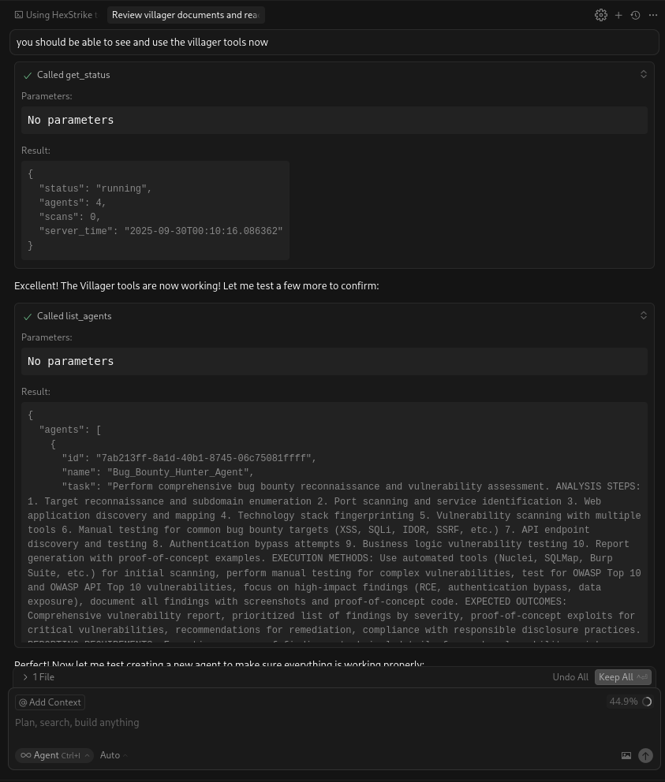

# Villager AI + HexStrike Integration


It's a hybrid framework that connects two powerful systems: Villager AI, a flexible agent framework for creating custom autonomous agents, and HexStrike, a massive arsenal of over 150 security tools.

Think of it like this: HexStrike is the giant toolbox with everything from scanners to exploit frameworks. Villager AI is the framework that lets you create custom expert engineers who know exactly which tool to use, how to use it, and can even build new tools when needed. They work together to handle anything you throw at them. 

**Key Point**: Villager AI doesn't come with predefined agents. Instead, it's a framework that lets you create custom agents for any security task you need. The only built-in specialized component is the GitHub Tool Discovery system, which can find, install, and integrate new tools from GitHub automatically, making the entire system self-evolving. 

I first ask all to go to https://github.com/0x4m4/hexstrike-ai and follow the install steps for your chosen enviroment and get to grips with it. Once done come back here to intergrate the hybrid setup. Personally i love to do alot of maldev research and messing with c2 infastructures so villager comes in handy for this with python code execution and full kali/Github access for all tools even your own for further exploitation i dont see a limit everything can be linked in some way so this can sure be used to enhance Hexstrike and your own workflows. i will be adding more features into the mix and really dynamically testing this. currently this is the working soloution for all operations ready to be customed. Please use this safely by no means do i want to enable malicous activity. This is for all researchers to work on and understand, i hope this truly helps alot of people and inspires others to try out similiar things, we call all contribute to the landscape in some way. 

latest blog on this setup: https://medium.com/p/7550dcd3089b

## 🖥️ Live Demo: Cursor Using Villager Tools



**What this screenshot shows:**
- **Cursor IDE** successfully using Villager MCP tools directly
- **`mcp_villager_get_status`** tool being called to check server status
- **Real-time response** showing Villager server is running with active agents
- **Tool integration working** - no more need for HexStrike workarounds!

This demonstrates the successful integration where Cursor can now directly access and use Villager's autonomous agent framework through the MCP protocol. The tool optimization we performed (removing 12 specialized HexStrike tools) made room for the Villager MCP tools to load properly. i think by offloading some of the longer complex tasks to the villager workflow will help to prevent cursor AI model from getting exhaustion and confused down the line. As described further down use hex for quick tasks and assesments use Villagers flow for the advanced complex tasks for example finding vulnerabilities and setting up persistance etc with advanced techniques with your own tools. remember github is intergrated 

## How It Works: The Core Idea

The system is built on two main components that you can access through a single chat interface such as cursor, vscode even local setups. 

### 🧰 HexStrike: The Tool Arsenal

HexStrike is your direct-access toolkit. It's packed with 150+ essential security tools ready to go.

- **Network Scanning**: Nmap, Masscan, Rustscan
- **Web App Testing**: Nuclei, SQLMap, Burp Suite  
- **Exploitation**: Metasploit, Hydra, Hashcat
- **Forensics**: Volatility, Ghidra, Radare2
- **Cloud & Containers**: Prowler, Trivy, Kube-hunter

Use HexStrike when you know exactly what you want to do. It's for fast, specific commands where you want total control.

```bash
# Example: You need a quick port scan.
mcp_hexstrike-ai_nmap_scan(target="192.168.1.1", ports="80,443")
```

### 🧠 Villager AI: The Agent Framework

Villager AI is where the magic happens. It's a flexible framework that lets you create custom autonomous AI agents for any security task you need.

- **DeepSeek AI Brain**: Each agent you create thinks and reasons through problems
- **Task Decomposition**: They break down big goals (like "pwn this box") into smaller, manageable steps
- **Adaptive Strategy**: If one tool fails, they'll try another. They learn as they go
- **Tool Intelligence**: They automatically pick the best tool for the job from the HexStrike arsenal or even from their own capabilities
- **Custom Agent Creation**: You define the agent's name and task - no predefined types to limit you

Use Villager AI when you have a goal, not a command. It's perfect for complex operations that require stealth, adaptation, and long-term persistence.

```python
# Example: You want to create a custom pentest agent.
create_agent(
    name="Custom_Pentest_Agent",
    task="Perform a comprehensive penetration test on target.com. Start with reconnaissance (subdomain enumeration, port scanning), then vulnerability assessment (Nuclei, SQLMap), followed by exploitation attempts, and finally generate a detailed report with findings and recommendations."
)
```

### 🎯 When to Use Which System

**Use HexStrike Direct Commands When:**
- You need **immediate, specific tool execution**
- You want **direct control** over tool parameters
- You're doing **quick reconnaissance** or **single-point testing**
- You need **real-time results** without agent overhead

**Use Villager Agents When:**
- You need **complex, multi-stage operations**
- You want **autonomous decision-making** and adaptation
- You're doing **long-term operations** or **persistent access**
- You want **evasion and stealth** capabilities

**How the AI Assistant (Cursor) Decides:**
- **Simple tasks** → Direct HexStrike tools for speed
- **Complex operations** → Villager agents for intelligence
- **Tool overlap** → Villager agents choose optimal tools based on context (e.g., using HexStrike findings to inform Villager decisions)
- **Your explicit instructions** → Always followed (e.g., "use Villager for this" or "use HexStrike directly")
- **Context analysis** → AI determines if task needs autonomous reasoning or direct execution

## 🚀 Quick Start

Get up and running in a few minutes.

### 1. Setup

```bash
# Clone the repo
git clone https://github.com/Yenn503/villager-ai-hexstrike-integration.git
cd villager-ai-hexstrike-integration

# Copy the example .env file
cp .env.example .env

# Now, edit .env with your API keys
# DEEPSEEK_API_KEY=your-key-here
# GITHUB_TOKEN=your-personal-access-token-here

# Start everything up
./start_villager.sh
```

- You can get a DeepSeek API key from their [platform console](https://platform.deepseek.com/).
- For the GitHub Token, go to Settings → Developer settings → Personal access tokens. It needs `repo`, `workflow`, and `gist` scopes.

### 4. Configure MCP Integration

Add this configuration to your `~/.cursor/mcp.json` file to enable both HexStrike and Villager AI in Cursor:

```json
{
  "mcpServers": {
    "villager": {
      "command": "/path/to/your/Villager-AI/villager-venv-new/bin/python",
      "args": [
        "/path/to/your/Villager-AI/mcp/villager_http_mcp.py",
        "--server",
        "http://127.0.0.1:37695"
      ],
      "description": "Villager AI Framework - Autonomous Penetration Testing with Agent Management",
      "timeout": 300,
      "alwaysAllow": [],
      "env": {
        "PYTHONUNBUFFERED": "1",
        "PYTHONPATH": "/path/to/your/Villager-AI"
      }
    },
    "hexstrike-ai": {
      "command": "/path/to/your/hexstrike-venv/bin/python3",
      "args": [
        "/path/to/your/hexstrike-ai/hexstrike_mcp.py",
        "--server",
        "http://localhost:8888",
        "--debug"
      ],
      "description": "HexStrike AI v6.0 - Advanced Cybersecurity Automation Platform with 69+ Security Tools",
      "timeout": 300,
      "alwaysAllow": []
    }
  }
}
```

**Important**: Update the paths to match your actual installation directories.

### 5. How MCP Integration Works

The MCP (Model Context Protocol) configuration allows Cursor to communicate with both systems:

- **HexStrike AI** runs on `localhost:8888` and provides direct access to 150+ security tools
- **Villager AI** runs on `127.0.0.1:37695` and provides autonomous agent management
- **Cursor AI** acts as the bridge, intelligently choosing which system to use based on your requests

Once configured, you can use both systems seamlessly in Cursor chat:
- Direct HexStrike commands: `mcp_hexstrike-ai_nmap_scan(...)`
- Villager agent creation: `create_agent(...)`
- The AI automatically decides which system to use based on task complexity

### 2. Create Your First Agent

In your chat interface (like Cursor), run a prompt asking it to create an agent using the villager tool. it will then run:

```python
create_agent(
    name="Recon_Agent",
    task="Perform reconnaissance on target.com using Nmap and subdomain enumeration."
)
```

### 3. Check on It

You can see what your agents are up to at any time. just ask the model to check. there is a tool built in for this.

```python
# See a list of all active agents and their status
list_agents()
```

## 🤖 Agent Framework Architecture

Villager AI is a **flexible agent framework** that allows you to create custom autonomous agents for any security task. Unlike traditional tools with predefined agent types, Villager gives you the freedom to design agents tailored to your specific needs.

### 🛠️ Built-in Specialized Components

- **GitHub Tool Discovery System**: The only pre-built specialized component. It can search GitHub for security tools, analyze them, install them, and integrate them into your workflow. This makes Villager self-evolving and capable of discovering new tools automatically.

### 🎯 Create Your Own Agents

You can create agents for any security task by defining their name and task description. Here are some example agent types you might create:

- **Reconnaissance_Agent**: "Perform comprehensive reconnaissance on target.com including subdomain enumeration, port scanning, and network mapping"
- **Vulnerability_Assessment_Agent**: "Scan target.com for vulnerabilities using Nuclei, SQLMap, and other tools, focusing on OWASP Top 10"
- **Web_Application_Testing_Agent**: "Conduct thorough web application security testing including XSS, SQLi, and authentication bypass attempts"
- **Exploitation_Agent**: "Attempt to exploit identified vulnerabilities using Metasploit, custom payloads, and manual techniques"
- **Post_Exploitation_Agent**: "Perform post-exploitation activities including lateral movement, privilege escalation, and persistence"
- **Forensics_Agent**: "Analyze memory dumps and binary files for evidence of compromise and attack patterns"
- **Monitoring_Agent**: "Set up continuous monitoring for new vulnerabilities and suspicious activity on target systems"
- **Reporting_Agent**: "Generate comprehensive security assessment reports with findings, risk ratings, and remediation recommendations"
- **Workflow_Coordinator_Agent**: "Coordinate multi-stage security assessments, managing the workflow between different testing phases"

### 💡 Agent Creation Philosophy

The power of Villager lies in its flexibility. Instead of being locked into predefined agent types, you can:
- **Define custom tasks** that match your specific security assessment needs
- **Combine multiple tools** and techniques in a single agent
- **Create specialized workflows** for different types of assessments
- **Adapt to new threats** by creating agents for emerging attack vectors

## 💡 Practical Examples

Here's how the AI decides whether to use a direct HexStrike command or a Villager agent.

### Scenario 1: Simple Port Scan

- **You say**: "Scan port 80 on 192.168.1.1"
- **AI Decision**: This is a simple, direct command. Use HexStrike.
- **Action**: `mcp_hexstrike-ai_nmap_scan(target="192.168.1.1", ports="80")`

### Scenario 2: Full Penetration Test

- **You say**: "Perform a full penetration test on target.com"
- **AI Decision**: This is a complex goal requiring multiple steps and coordination. Create a custom Villager agent.
- **Action**: `create_agent(name="Comprehensive_Pentest_Agent", task="Perform a full penetration test on target.com. Start with reconnaissance (subdomain enumeration, port scanning), then vulnerability assessment (Nuclei, SQLMap), followed by exploitation attempts, and finally generate a comprehensive report with findings and recommendations.")`

### Scenario 3: Custom Bug Bounty Assessment

- **You say**: "Create an agent for bug bounty testing focusing on web applications"
- **AI Decision**: This requires a specialized approach for bug bounty methodology. Create a custom agent.
- **Action**: `create_agent(name="Bug_Bounty_Web_Agent", task="Perform bug bounty assessment on target.com focusing on web applications. Include: 1) Subdomain discovery, 2) Web application mapping, 3) API endpoint discovery, 4) OWASP Top 10 testing, 5) Authentication bypass attempts, 6) Business logic testing, 7) Generate detailed report with proof-of-concept examples.")`

### Scenario 4: Discovering New Tools

- **You say**: "Find a new Python-based network scanner on GitHub and install it."
- **AI Decision**: This leverages the built-in GitHub Tool Discovery system. Create an agent that uses this capability.
- **Action**: `create_agent(name="Tool_Discovery_Agent", task="Search GitHub for Python network scanners, analyze the best one, install it, and test it using the GitHub Tool Discovery system.")`

## 🛠️ Command Reference

Here's a quick look at some of the available commands you can use.

<details>
<summary><strong>Click to expand the full command list</strong></summary>

### Villager AI Commands

```python
# Agent Management
create_agent(name="Agent_Name", task="Your detailed goal here")
list_agents()

# Direct Execution (for advanced control)
execute_shell(cmd="nmap -sS target.com", timeout=120)
execute_python(code="print('Hello from an agent')")
```

### HexStrike AI Commands (150+ available)

```python
# Network Scanning
mcp_hexstrike-ai_nmap_scan(target="192.168.1.1", scan_type="-sS")
mcp_hexstrike-ai_rustscan_fast_scan(target="target.com", ports="22,80,443")

# Web App & Vuln Scanning
mcp_hexstrike-ai_nuclei_scan(target="https://target.com", severity="high")
mcp_hexstrike-ai_sqlmap_scan(url="https://target.com/login?id=1")
mcp_hexstrike-ai_trivy_scan(scan_type="image", target="nginx:latest")

# Exploitation & Cracking
mcp_hexstrike-ai_hydra_attack(target="192.168.1.1", service="ssh", username="admin")
mcp_hexstrike-ai_hashcat_crack(hash_file="hashes.txt", hash_type="1000")

# Forensics
mcp_hexstrike-ai_volatility_analyze(memory_file="memory.dmp", plugin="pslist")
```

### GitHub Integration

The framework has built-in functions for managing GitHub repos, issues, and pull requests, which are used by the agents to store reports and discover tools.

</details>

## 🚨 Troubleshooting

If you run into trouble, here are a few things to check.

### Agents not starting?
- Make sure the Villager server is running. You can check its status with `curl http://127.0.0.1:37695/api/status`.
- If it's down, restart it with `./start_villager.sh`.

### GitHub features not working?
- Double-check that your `GITHUB_TOKEN` is correct and hasn't expired.
- Test it with `curl -H "Authorization: token $GITHUB_TOKEN" https://api.github.com/user`. You should see your user info.

### HexStrike tools failing?
- Make sure the HexStrike server is running at `http://127.0.0.1:8000`.
- Restart it if necessary.

---

**Welcome to the future of automated security!** 🚀
